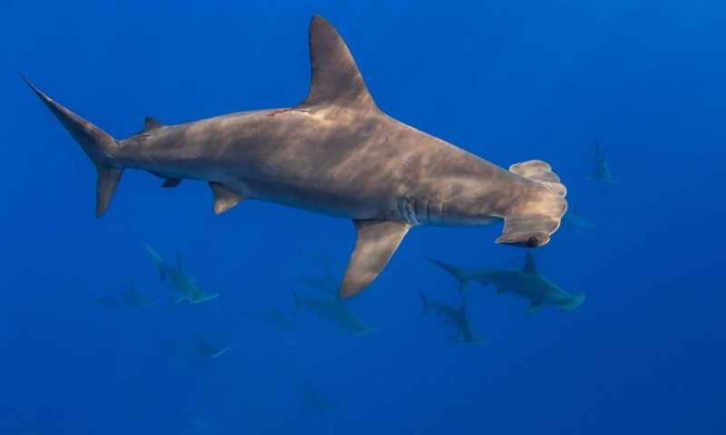

```{r setup, echo = TRUE, messages = FALSE, warnings = FALSE}
knitr::opts_chunk$set(echo = TRUE, messages = FALSE, warnings = FALSE)

library(tidyverse)
library(sf)
library(terra)
library(here)
```

# Session summary

For this EcoDataScience session, we will cover some basics of working with spatial data presented in a gridded format, i.e., rasters, using the `raster` package.  This is distinct from vector data, such as points, lines, and polygons, which are not constrained to a grid but have problems of their own.  This will be an overview of rasters, introducing basic concepts of creating them, modifying them, and doing basic analyses with them.  This first script focuses on creating and preparing rasters to be used in a simple analysis.

NOTE: This will not use the `stars` package, which is a massive overhaul of raster-style data for R to work more seamlessly with data arrays in a manner similar to `sf` for vector data, but is still in development.  We will use the `terra` package, a recent thorough revamping of the older `raster` package that is faster, but otherwise similar, and works great for the most common types of gridded data.  I suspect `stars` will eventually be the go-to for raster type data, but `terra` is also great.

# Creating a raster

As with many things in R, there are many ways to create rasters depending on the information you have to start.  There are several parameters that every raster must have:

* A coordinate reference system (CRS), i.e., a system to locate things spatially on the surface of the earth - basically a definition of the shape of the globe (hint: not a sphere), some way to identify where X = 0 and Y = 0, and quite likely some projection to convert curved space into flat space.  Includes units, often degrees or meters.
* An origin, i.e., what is the spatial coordinate of the grid point closest to (0, 0), sort of like how far is your grid offset from a perfect alignment.
* A resolution, i.e., what is the length of the sides of each grid cell, in both X and Y.  This is in units given in the coordinate reference system.
* An extent, i.e., what are the corners of the box that bounds your raster.

If you want to use multiple rasters in an analysis, these generally all have to match up across all your rasters.

## Creating a raster from X and Y coordinates on a regular grid

We can create a raster with X-Y coordinates (e.g., lat/long or meters E/meters N).  Here we're using a truncated dataset from AquaMaps that includes cell IDs on a lat-long grid.  

We will map these cell IDs (`loiczid`) to their spatial locations using `terra::rast()` using the `type = 'xyz'` argument.  The input dataframe columns must be in order of `x`, `y`, and `z` (for cell value) though they don't need to have those names (e.g., 'long', 'lat', 'cell_id' would work too!).


``` {r create raster using a dataframe with x-y-z values}
### Read a truncated version of the AquaMaps Half-degree Cell
### Authority File (HCAF) - cell IDs, locations, ocean area, in a dataframe
hcaf_df <- read_csv(here('_data/am_hcaf.csv'))

### View the dataframe - note the different columns included in it.
### LOICZID is "Land Ocean Interactions in the Coastal Zone" cell ID, but
### really just a unique number for each cell.

### create an xyz dataframe for the rast function.  Use
### loiczid as cell value.
xyz_df <- hcaf_df %>%
  select(center_long, center_lat, loiczid)

hcaf_rast <- terra::rast(xyz_df, type = 'xyz')
crs(hcaf_rast, proj = TRUE) 

### oh noes, it's empty, that's no good! We know this is lat-long
### data so we can use WGS84, based on the EPSG code
crs(hcaf_rast) <- 'EPSG:4326'   
  ### or '+proj=longlat +datum=WGS84 +no_defs', same thing

hcaf_rast ### look at the basic info about the raster
```

Plot the raster with base R `plot()`:

```{r}
plot(hcaf_rast)

```

Pretty boring, but each cell now has a unique (non-spatial) identifier that matches the values in the AquaMaps species rangemap data we'll use in a minute.

Write out the raster to a file.  Note, the `overwrite = TRUE` is just there because I've already run and created the file; if I left it as default (`FALSE`) it would give me an error to prevent me from overwriting.

```{r}
writeRaster(hcaf_rast, here('_spatial/hcaf_rast.tif'), overwrite = TRUE)
```

## Creating a raster from scratch

We can also create a raster from scratch, again using `terra::rast()`.  We can also set the name of the layer using `setNames()`

```{r manually create the same raster from scratch}
hcaf_rast2 <- rast(xmin = -180, xmax = 180, ymin = -90, ymax = 90,
                   resolution = 0.5,
                   crs = 'EPSG:4326') %>%
  setNames('loiczid')

### The LOICZID values are not tricky - they start at 1 in upper left, increase
### as you moving right, then at the end of the first row, drop to the leftmost
### cell in the second row, etc.  We can fill those values easily:
values(hcaf_rast2) <- 1:ncell(hcaf_rast2)

hcaf_rast   ### check the parameters of the original one
hcaf_rast2  ### check the parameters of the new one

### check to see whether the two rasters are identical
all.equal(hcaf_rast, hcaf_rast2)

### no need to save, we already have one that works just fine...
```

## Use `subst()` to substitute raster cell values for other values in a dataframe

Let's create a raster that contains the proportion of each cell that is "ocean": 1 = all ocean, .5 = part land, part ocean, etc.

```{r examine ocean area by cell}
ocean_area_df <- hcaf_df %>%
  mutate(pct_ocean = ocean_area / cell_area) %>%
  filter(pct_ocean > 0)

### use terra::subst() to substitute in new values for original raster values
pct_ocean_rast <- subst(hcaf_rast,
                        ### what is the value that matches the raster:
                        from = ocean_area_df$loiczid,
                        ### what is the new value to swap in its place:
                        to   = ocean_area_df$pct_ocean,
                        ### what value to put in unmatched cells:
                        others = NA)

### inspect parameters:
pct_ocean_rast

plot(pct_ocean_rast)

writeRaster(pct_ocean_rast, here('_spatial/ocean_rast.tif'),
            overwrite = TRUE)
```

Note: we could have used `terra::rast(type = 'xyz')` here too, simply using `x` = longitude, `y` = latitude, and percent ocean area as the `z` value.

# Practice with `subst()` on real data

The nice thing about `terra::subst()` is that we can do a lot of work in the Tidyverse and then simply plop the results into a previously generated raster, based on cell IDs.

Load and examine the AquaMaps information on sharks, as dataframes:

* taxonomic information on sharks found in the region
* a lookup table that maps shark species IDs to cell IDs

NOTE: these are trimmed down from the full AquaMaps dataset for size, so they don't fill up the whole map (focusing on SE Africa near Mozambique and Madagascar), and only include shark species.

``` {r load shark species data and cell info}
### taxonomic info on shark species within southeastern Africa EEZs
am_spp_info <- read_csv(here('_data/am_shark_info.csv'))
### species ID to cell probability lookup table - maps species to cells
am_spp_cells <- read_csv(here('_data/am_shark_cells.csv'))
```

### Scalloped hammerhead range


```{r use subs to examine the range for scalloped hammerhead}
### View am_spp_info and search to find ID for "scalloped hammerhead" and
hh_id <- 'Fis-23273'
hh_cells_df <- am_spp_cells %>%
  filter(am_sid == hh_id)

### use terra::subst() to substitute in values for others
hh_range_rast <- subst(hcaf_rast, ,
                      from = hh_cells_df$loiczid,
                      to   = hh_cells_df$prob,
                      others = NA)
plot(hh_range_rast)

### that's way more map space than we need!  terra::trim() can trim it to remove
### the whitespace
hh_range_rast <- hh_range_rast %>%
  terra::trim()

hh_range_rast
plot(hh_range_rast)
writeRaster(hh_range_rast, here('_spatial/hammerhead_rast.tif'),
            overwrite = TRUE)
```

### Silky shark range


```{r use subs to examine the range for silky shark}
### View am_spp_info and search to find ID for "silky shark" and
ss_id <- 'Fis-23054'
ss_cells_df <- am_spp_cells %>%
  filter(am_sid == ss_id)

### use terra::subst() to substitute in values for others
ss_range_rast <- subst(hcaf_rast, 
                       from = ss_cells_df$loiczid,
                       to   = ss_cells_df$prob,
                       others = NA) %>%
  trim()
plot(ss_range_rast)

writeRaster(ss_range_rast, here('_spatial/silkyshark_rast.tif'),
            overwrite = TRUE)
```


# Reprojecting a raster

Often we are given a raster in a resolution and/or coordinate reference system that is different from our other sources of data.  We can reproject a raster to new parameters (origin, resolution, extent, and CRS) using `terra::project()`.  Note, for vector data using the `sf` package, we can use `st_transform` for a similar result.

Our AquaMaps data is in a generic lat-long format, but for Mozambique, they prefer to use a different CRS (EPSG:6933).  Since the results will be used by WCS scientists in Mozambique, let's use the Mozambique preferred CRS.  We will create a new base raster for analysis, at a 10 km resolution equal area, in the same CRS as provided by WCS in a shapefile of SE Africa EEZs.

Because we don't want to interpolate between our categorical cell ID (`loiczid`) values, we can use the "nearest neighbor" method.  Other methods exist to more smoothly interpolate.

``` {r reproject wgs84 raster to mozambique crs}
se_afr_eez_sf <- read_sf(here('_spatial/moz_eez', 'se_afr_eez.shp'))
# crs(se_afr_eez_sf, proj = TRUE) 
# [1] "+proj=cea +lat_ts=30 +lon_0=0 +x_0=0 +y_0=0 +datum=WGS84 +units=m +no_defs"
# crs(hcaf_rast, proj = TRUE) 
# CRS arguments: +proj=longlat +datum=WGS84 +no_defs

### First, let's use mask to keep only cells with non-zero ocean
hcaf_rast_mask <- terra::mask(hcaf_rast, pct_ocean_rast)
plot(hcaf_rast_mask)

### Then, crop the global hcaf raster down to the same extent as our range map
hcaf_rast_crop <- terra::crop(hcaf_rast_mask, hh_range_rast)

### Next use terra::project to change the CRS and resolution
hcaf_rast_reproj <- project(x = hcaf_rast_crop, 
                            y = crs(se_afr_eez_sf),
                            method = 'near', ### nearest neighbor
                            res = 10000) ### resolution 10000 m = 10 km
# hcaf_rast_crop
# hcaf_rast_reproj
plot(hcaf_rast_reproj)

writeRaster(hcaf_rast_reproj, here('_spatial/hcaf_rast_6933.tif'), overwrite = TRUE)

```

And important understanding: we've reprojected half-degree cells (around 55 km x 55 km at the equator), each with a unique cell ID, to 10 km x 10 km cells.  These new smaller cells are diced versions of the larger cells, but still contain the same cell IDs as the original larger cell, because we used "nearest neighbor" i.e., `method = "near"`.

```{r compare low-res to high-res versions for cell counts}
values_lo_res <- values(hcaf_rast_crop)
### make a table of number of cells for each values; use 'head()' just to see 
### the first 20 instances
table(values_lo_res) %>% head(20)
### one cell per cell ID value

values_hi_res <- values(hcaf_rast_reproj)
table(values_hi_res) %>% head(20)
### between 24 and 30 cells per cell ID value
```

We can see there are (at least for these first few cell IDs) 24 or 30 new 10km x 10km cells from each old 0.5° x 0.5° cell.

# Plotting with rasters

We've been using the base `plot` function to plot our rasters.  It works fine, but is not fancy.  We'll keep using that for simple plots, but we can also use `ggplot2` to plot our rasters, using the `geom_raster()` function.  However, we can't just plop in the raster itself - we have to turn it into a dataframe of coordinates (`ggplot2` likes dataframes!).  Just as before we used `rast(type = 'xyz')`, here we can use `as.data.frame(xy = TRUE)` to go the other direction.

Note `geom_sf` works with simple features polygons just fine.  But high resolution polygons take a while to plot.  Here we're using a very simplified EEZ shapefile for speed.

``` {r reproject hammerhead range and plot it}
### Let's transform the hammerhead range to the Mozambique CRS.
### could do either of these:
### * project() from half-degree cells to 10 km cells
### * subst() into the new projected hcaf 10 km cell raster, using the cell IDs
hh_range_reproj <- subst(hcaf_rast_reproj,
                         from = hh_cells_df$loiczid, 
                         to = hh_cells_df$prob,
                         others = NA) %>%
  setNames('prob')

### plot this using ggplot, and add the EEZ layer on top.  First,
### need to turn the raster into a dataframe... note the name of the
### third column is the same as we assigned to the raster, using setNames().
hh_range_df <- as.data.frame(hh_range_reproj, xy = TRUE)

ggplot() +
  geom_raster(data = hh_range_df, aes(x, y, fill = prob)) +
  geom_sf(data = se_afr_eez_sf, color = 'red', fill = NA) +
  scale_fill_viridis_c()

```

## Creating a `plot_rast()` function

Because I'd like to keep plotting rasters with polygons on top for reference, I will create a function to let me use a single line of code.

``` {r set up plot_rast utility function}
### The above lines of code to plot the raster with the sf 
### are coded into a function here, for future ease of use:
plot_rast <- function(rast, sf) {
  ### function to plot a raster with a simple features border overlaid
  rast_crs <- crs(rast)
  sf_crs   <- crs(sf)
  ### error check: make sure CRS are equal
  if(rast_crs != sf_crs) {
    error_msg <- sprintf('CRS mismatch!\n    raster: %s\n    sf: %s',
                         as.character(crs(rast)), crs(sf))
    stop(error_msg) ### stops everything and communicates an error
  }
  
  fill_name <- names(rast)
  ### convert raster to points
  rast_df <- as.data.frame(rast, xy = TRUE) %>%
    setNames(c('x', 'y', 'z'))
  
  ### ggplot the raster points and the simple features
  x <- ggplot() +
    geom_raster(data = rast_df, aes(x, y, fill = z)) +
    geom_sf(data = sf, color = alpha('red', .3), fill = NA) +
    labs(fill = fill_name) +
    scale_fill_viridis_c() +
    coord_sf() +
    theme_void()
  
  return(x)
}

plot_rast(hh_range_reproj, se_afr_eez_sf)
```

Note that the square cells don't line up well with the smoother coastline...

# Rasterizing polygons

It is easy to turn a polygon into a raster, but we will need to know the parameters of the target raster (origin, resolution, extent, CRS).  Often we will already have these inside an existing raster object. We can create a Mozambique EEZ raster at least three ways:

1.  Use `terra::rasterize()` to rasterize the `se_afr_eez_sf` region IDs to our 10 km scale for all SE Africa EEZs.
    * then, identify the Mozambique EEZ ID number and keep just the cells that match that ID.
    * To do this, set all non-Mozambique cell values to NA.
2.  As above, use `terra::rasterize()` to rasterize the region IDs to our 10 km scale for all SE Africa EEZs.
    * Use a polygon of just the Mozambique EEZ (isolated out of `se_afr_eez_sf`) and `mask()` our raster to just those cells where the polygon overlaps.
3.  Directly `rasterize()` the Mozambique EEZ polygon.

Let's create a Mozambique raster using method 1, and then use that to `mask` our hammerhead range to just locations within Mozambique's EEZ.  Looking at the `se_afr_eez_sf` dataframe, we can see that the `mrgid` ID for Mozambique is 8347.

```{r create mozambique eez mask}
### same as version 1:
se_afr_eez_rast <- rasterize(se_afr_eez_sf, hcaf_rast_reproj, field = 'mrgid')
moz_mrgid <- 8347

### create a copy that we can set non-Moz cells to NA
moz_eez_rast <- se_afr_eez_rast
moz_eez_rast[!moz_eez_rast %in% moz_mrgid] <- NA

plot_rast(moz_eez_rast, se_afr_eez_sf)

### mask the hammerhead to just Mozambique using this new raster
hh_range_moz <- mask(hh_range_reproj, moz_eez_rast)
plot_rast(hh_range_moz, se_afr_eez_sf)

writeRaster(hh_range_moz, here('_spatial/hh_rast_6933.tif'), overwrite = TRUE)
```

Let's create a masked range raster for the silky shark, like we did for the hammerhead.  Last time we used `subst()` on the reprojected `hcaf_rast`; this time let's use it on the *un*projected `hcaf_rast`, then `project()` and then mask it, and write it out.

This time, however, our data is not cell IDs (discrete), but probabilities (continuous).  Because of that, perhaps we would like to let R interpolate values for intermediate cells to smooth the map.  Last time we used the nearest neighbor (`'ngb'`) to maintain the discrete values, but here let's use `method = 'bilinear'`.

```{r make a masked range raster for silky shark}
### Note, there are gaps in its range, where
### probability is zero - but they show up as NA.  Let's replace all NAs with
### zero first, then mask out ocean cells, so land will go back to NA.

### identify the indices in the vector where NA, and replace with zero
ss_range_rast[is.na(ss_range_rast)] <- 0
plot(ss_range_rast, main = 'Silky shark, half degree, SE Africa',
     axes = FALSE, col = hcl.colors(20))

### now reproject, crop
ss_range_se_afr <- project(ss_range_rast, hcaf_rast_reproj, 
                           method = 'bilinear') %>%
  mask(moz_eez_rast)
plot_rast(ss_range_se_afr, se_afr_eez_sf) +
  labs(title = 'Silky shark, Moz only, 10 km',
       subtitle = 'bilinear interpolation')
### compare ngb and bilinear

writeRaster(ss_range_se_afr, here('_spatial/ss_rast_6933.tif'), overwrite = TRUE)
```

## Rasterizing other types of vector data

We can also rasterize vector data as lines and points.  Let's rasterize a shapefile of points indicating Mozambique ports, using our reprojected AquaMaps LOICZID raster.  Then let's try terra::distance() to create a raster of distance to nearest port, then mask to just Mozambique's EEZ.

```{r}
ports_sf <- read_sf(here('_spatial/moz_ports/Moz_ports_updated.shp'))
class(ports_sf) 
### [1] "sf"         "tbl_df"     "tbl"        "data.frame"
st_crs(ports_sf)
### in generic lat-long, 4326.  Need to transform it to the Mozambique CRS
moz_eez_sf <- se_afr_eez_sf %>%
  filter(territory == 'Mozambique')
ports_sf <- ports_sf %>%
  st_transform(crs = st_crs(moz_eez_sf))

ports_rast <- terra::rasterize(ports_sf, hcaf_rast_reproj, field = 'OBJECTID_1')

port_dist_rast <- ports_rast %>%
  terra::distance() %>%
  mask(moz_eez_rast) %>%
  setNames('Dist to port')

plot_rast(port_dist_rast, moz_eez_sf) +
  geom_sf(data = ports_sf, shape = 21, color = 'white', fill = 'red', size = 2)
writeRaster(ports_rast, here('_spatial/moz_ports_6933.tif'), overwrite = TRUE)
```

# More `subst()` with a simple analysis

Let's make a species richness map, by counting how many distinct shark species can be found in each cell.  To do this, we can use the dataframe of shark species to cells, `am_spp_cells`.  For each cell, we can count up how many distinct species IDs occur.  Assign this to the 0.5° cells, then reproject with `method = 'bilinear'`, and write it out.

Note: let's say for a shark species to count in a cell, there must be greater than 50% probability.

``` {r species richness map}
### map out the shark species richness
shark_rich_df <- am_spp_cells %>%
  filter(prob >= .50) %>%
  group_by(loiczid) %>%
  summarize(n_sharks = n_distinct(am_sid))

shark_rich_rast <- subst(hcaf_rast, ### unprojected version!
                         from = shark_rich_df$loiczid,
                         to   = shark_rich_df$n_sharks,
                         others = NA) %>%
  setNames('Spp richness') %>%
  project(hcaf_rast_reproj, method = 'bilinear') %>%
  mask(se_afr_eez_rast)

### Let's plot but also add Natural Earth country outlines
natearth_africa <- rnaturalearth::ne_countries(continent = 'Africa',
                                         returnclass = 'sf') %>%
  st_transform(6933) %>% ### transform to Mozambique CRS
  st_crop(se_afr_eez_sf)

plot_rast(shark_rich_rast, moz_eez_sf) +
  geom_sf(data = natearth_africa)
writeRaster(shark_rich_rast, here('_spatial/spp_richness_6933.tif'), 
            overwrite = TRUE)
```

Looks like most shark species in SE Africa like to stay close to the shores!

# Review: what have we done so far?

* created a raster from evenly-spaced lat-long data
* created a raster from scratch by directly giving parameters - an extent/bounding box (xmin, xmax, ymin, ymax), resolution, and CRS
* added a coordinate reference system to a raster, and checked it.
* used `terra::subst()` to substitute desired values into a raster, replacing cell ID values
* plotted a raster quickly using base plot function.
* used `terra::trim()` to remove excess NA values (i.e. whitespace border) from a raster
* used `terra::project()` to reproject an existing raster to the parameters (extent, origin, resolution, CRS) of a different raster
* plotted a raster using `ggplot2::geom_raster()` by converting the raster to a dataframe
* plotted a simple features polygon on top of the raster using `ggplot2::geom_sf()`
